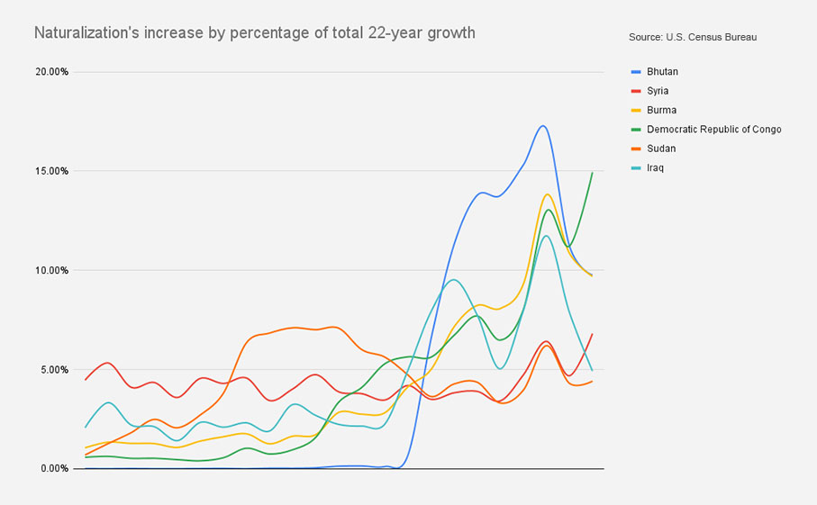
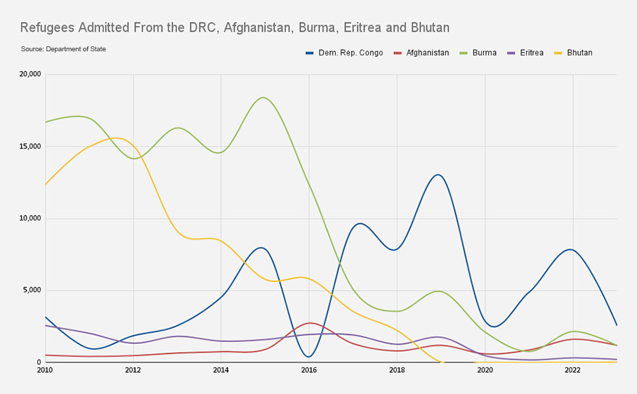
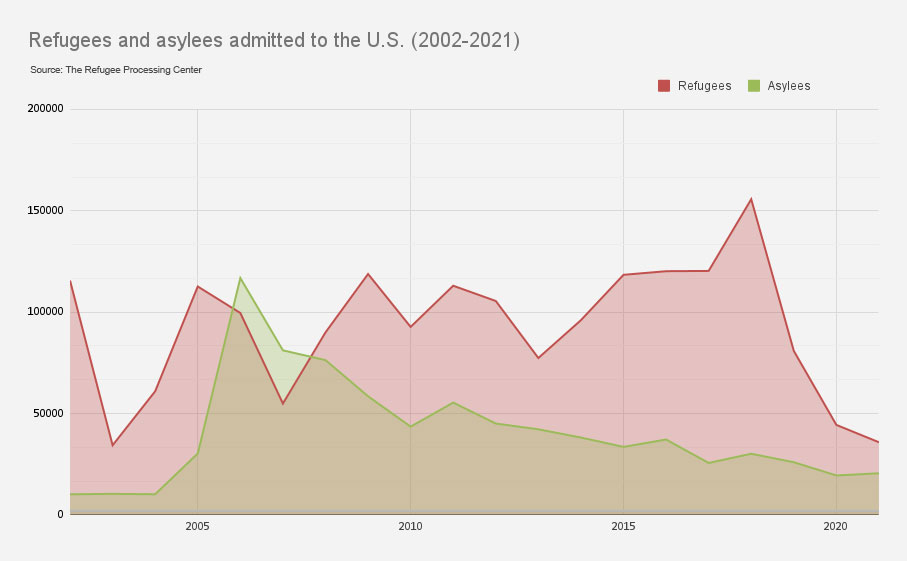
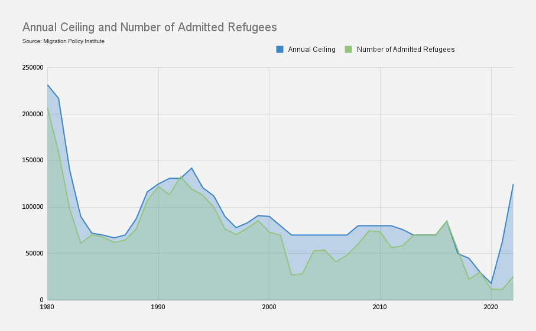

# Refugees are among the fastest groups in U.S. naturalization during the past two decades

Refugee populations in the United States have witnessed a faster rate of naturalization than other migrant groups during the past twenty years [according to the U.S. Census Bureau data. ](https://docs.google.com/spreadsheets/d/1DkQngdQOYKiHlS_HsX7NxatTcu34XaSQLT1_TAVGw-4/edit?usp=sharing)

Populations of new American citizens who were born in Bhutan, the Democratic Republic of Congo, and Burma, have been among the fastest growing during the past two decades. 

The United States naturalized just four citizens who were born in Bhutan in 2001. The number increased to almost 7000 in 2019 just before the Covid-19 pandemic.

Bhutan witnessed turmoil in the early 1990s. Tens of thousands of ethnic Nepalis were expelled from the Himalayan Kingdom according to Human Rights Watch. More than 77,000 refugees were admitted to the United States from Bhutan between 2010 and 2018, [according to Refugee Processing Center data](https://docs.google.com/spreadsheets/d/1hqNNStmSlAoCt313Ifg4ynHKxxem8dnH/edit?usp=sharing&ouid=114272850365599444803&rtpof=true&sd=true).

A steady flow of refugees was also admitted to the United States from the Democratic Republic of Congo. The second-largest country in Africa witnessed continuous waves of violence causing the internal displacement of five million people within the nation.  

Just over 100 new U.S. citizens came from the Democratic Republic of Congo in 2001. The United States has since naturalized more than 20,000 new citizens who were born in the Central African nation. 

“You will find that acquisition of citizenship is always very high among refugee populations,” Michelle Mittelstadt, the Director of Communications at the Migration Policy Institute said.

The majority of refugees resettled in the United States during the past decade came from the Democratic Republic of Congo, Burma, Bhutan, and Somalia. One out of five refugees admitted to the United States since 2010 came from Burma. In 2019, almost half of the refugees admitted to the United States came from the Democratic Republic of Congo. 

“They do not have the sense that they'll be returning to the country of origin, and many of them have been so relieved to come to a permanent stable situation, that they intend to always make their homes here,” Middelstadt said.

Naturalization in the United States is usually granted to lawful permanent residents after meeting certain requirements. The path to permanent residency in the U.S. is usually easier for refugees and asylum seekers.

Immigrants aiming to gain permanent residency or green cards often face a tedious task governed by bureaucracy and quotas that limit certain nationalities. However, refugees are allowed and required to apply for legal permanent residence after a year of living in the United States, according to the United States Citizenship and Immigration Services (USCIS). 

“Refugees are people who went through an entire vetting and screening process while they were outside the United States”, Middelstadt said. “They are more vetted than other immigrant groups.”

[While asylees arrive spontaneously at U.S. borders to seek protection, refugees apply for protection while overseas](https://docs.google.com/spreadsheets/d/1NeEKLdyNF37NbZcX2Q80m9nwD6UAV0Ai/edit?usp=sharing&ouid=114272850365599444803&rtpof=true&sd=true). When it comes to resettling these refugees, The United States delegates the task to non-governmental voluntary organizations. 

“We rely in the United States very much on nonprofit assistance and the willingness of governments to provide basic services,” said Lauren Carruth, an Associate Professor at American University. 

The Church World Service, the Ethiopian Community Development Council, and the International Rescue Committee (IRC) are among the non-profit refugee resettlement agencies that partner with the United States government

“Nonprofits help connect people to those services, and that's a huge determining factor about where people get resettled,” Carruth said. 

The U.S. Census Bureau data shows that new citizens from shared places of birth often cluster in specific states. Almost 25 percent of all naturalized citizens who were born in Bhutan chose to live in Ohio by the time they gained their citizenship. Refugee settlement non-profits play a major role in deciding where newcomers find a new home.  

“These organizations have hundreds of affiliates around the United States, and the affiliates sometimes tend to specialize. They have more expertise in certain nationalities”, Middelstadt said. 

The clustering of refugees in certain states is also related to financial reasons.  

“[Refugees] are expected to be self-sustaining and financially supporting themselves quickly after their arrival,” Middelstadt said. “The voluntary organizations that do the work of refugee resettlement try very hard to find climates that are going to be conducive for refugees to be able to come.” 

During the past 15 years, almost one out of six American citizens that were born in the Democratic Republic of Congo chose to reside in Texas. More than 11 percent of naturalized citizens who were born in Burma chose to live in Indiana. 

“Texas is a state where housing has been plentiful, and housing costs have been relatively low when compared to the rest of the country, and where jobs have been plentiful and in particular jobs at lower ends of the skill spectrum,” Middelstadt said. 

“Refugees may come with very significant skills, but if they've been in refugee camps or they've been in countries of first asylum and had not been able to work, they may have suffered some erosion of their skills and often take sort of the first job rather than the best job,” Middelstadt added. 

While the work of these non-profit agencies has provided a new home to tens of thousands of refugees, the United States’ delegating the task of resettling refugees to non-governmental entities doesn’t come without criticism. 

“The problem with nonprofits is that their accountability mechanisms may not be equal”, Carruth said. “You can't vote them out with your feet. If a host community or refugee communities themselves finds their work to be problematic, you can't tell a nonprofit where to go. But if it's your local government that's sort of doing a poor job, you can vote out your representative.”

When it comes to resettling refugees, the United States hit a historic low in 2020 with just over 11,000 refugees admitted. This comes after a steady decrease of refugees allotted quotas during the Trump administration years. However, the U.S. right now is in the midst of historic levels of asylum-seeking at the southern border according to the Migration Policy institute. 

“The U.S. has long been viewed as a leader in refugee resettlement around the world. And what has been happening over the last few years has not been consistent with that track record,” Middelstadt said. 

The Trump administration left its mark not only on the number of refugees admitted but also on the capacity of the non-profit organizations that handle the task of resettling those who seek refuge far from the border. [During 2022, resettling efforts failed to admit a quarter of the designated quota for the year. Just over 25,000 refugees were admitted out of 125,000. ](https://docs.google.com/spreadsheets/d/1_J78MxSuVFKZ9wuI77Qy_nHJgd_GqdYH/edit?usp=sharing&ouid=114272850365599444803&rtpof=true&sd=true)

“Because refugee funding was almost zeroed out by the Trump administration, the network of nonprofits who were taking care of refugees and resettlement budgets were zeroed out as well. They have struggled because they've lost so much. They lost so many people. They have been decimated,” Carruth said. 

According to the United Nations, there were 89.3 million people forcibly displaced worldwide at the end of 2021. Among those were 27 million refugees,

"We have low unemployment in this country, and we have a need for labor. And so it would behoove us economically to have more refugees. Countries like Germany have always shown how beneficial to the economy refugees can be," Carruth said. 

